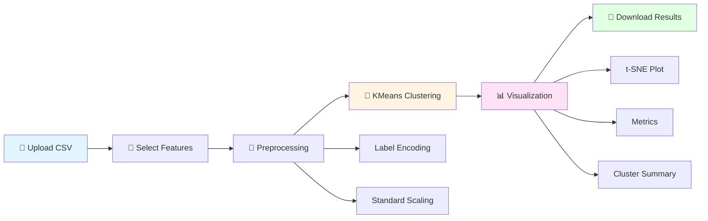

# 📄 Customer Clustering App 

## 📌 Project Overview
**Customer Clustering App** is a user-friendly web application built using Streamlit. It allows users to:
- Upload customer data (CSV format),
- Choose relevant features,
- Apply KMeans clustering,
- Visualize clusters using t-SNE,
- Download the clustered data for further analysis.

This tool is useful for business analysts and data scientists to segment customers based on behavioral and demographic features.

---

## 📊 Workflow

---
## ⚙️ Technologies Used
- **Python** (Core language)
- **Streamlit** (Web application framework)
- **Pandas** (Data handling)
- **Seaborn & Matplotlib** (Data visualization)
- **scikit-learn** (Clustering, preprocessing, evaluation)
- **t-SNE (TSNE from sklearn.manifold)** (Dimensionality reduction for visualization)

---

## 🚀 Features

### ✅ Upload & Preview Dataset
- Upload CSV files containing customer data.
- Preview the first few rows using `st.dataframe`.

### 📊 Feature Selection
- Select which columns to use for clustering.
- Categorical columns are automatically encoded.
- Missing values are dropped for cleaner analysis.

### 🧪 Data Preprocessing
- Label encoding for categorical features.
- Standard scaling using `StandardScaler`.

### 🤖 KMeans Clustering
- Choose `k` (number of clusters) using a slider (range: 2–10).
- KMeans model is trained and labels are assigned.

### 📈 Evaluation Metrics
- **Inertia**: Measures internal cluster cohesion.
- **Silhouette Score**: Evaluates how similar a point is to its own cluster vs other clusters.

### 🌐 t-SNE Visualization
- 2D visualization of clusters using t-SNE.
- Interactive Seaborn scatter plot with color-coded clusters.

### 📥 Downloadable Output
- Clustered data includes original features + cluster labels.
- Download button to export results as a CSV file.

---

## 🧠 How to Use the App

1. **Upload Data**  
   Upload a `.csv` file with customer data.

2. **Select Features**  
   Use the multiselect box to pick relevant features for clustering.

3. **Choose Number of Clusters**  
   Adjust the `k` value using the slider.

4. **Explore Results**  
   - View evaluation metrics (Inertia, Silhouette Score).
   - Visualize clusters via t-SNE scatter plot.
   - Review average values for each cluster.

5. **Download Data**  
   Click the download button to save the clustered dataset.

---

## 📌 Notes
- Ensure your dataset has no missing critical values.
- Larger datasets may slow down t-SNE due to its computational cost.
- Label encoding may affect interpretation of categorical variables.

---

## 📎 File Structure
customer_clustering_app/

├── app.py  # Main Streamlit app

├── requirements.txt # Python dependencies

└── DOCUMENTATION.md # Technical documentation 

└── new.csv # Sample Input File 

